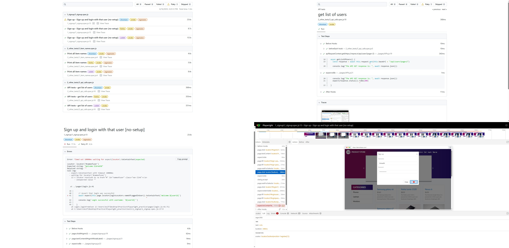
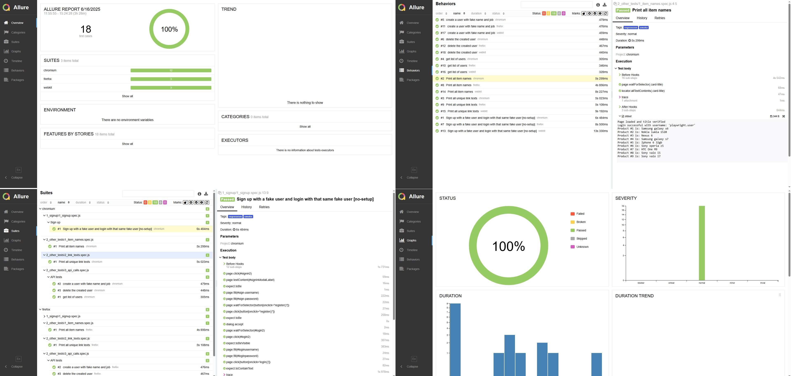

# Playwright Web/API Automation
A robust end-to-end testing framework built using [Playwright](https://playwright.dev) with a Page Object Model (POM) structure, API testing integration, Allure reporting, and GitHub Actions CI.

---

## Features

- ✅ Page Object Model (POM) design pattern
- 📲 UI + API testing in a unified repo
- 🧪 Built-in fake data generation using `@faker-js/faker`
- 📊 Beautiful Allure and HTML reports
- ☁️ GitHub Actions for CI integration
- 🧠 Global setup logic using test metadata/tag conditions
- 🎥 Video + trace recording on test failures

---
## Project Structure
```
Playwright-Automation-POM/
│
├── tests/                       # All test specs go here
│   └── sample.spec.js
│
├── pages/                       # Page Object Model classes
│   └── sample_page.js
│
├── utilities/                   # Utility/helper functions
│   └── utils.js
│
├── data/                        # All generated/test data is stored in this folder
│   └── data.json
│
├── global_setup/                # This folder contains global beforehook codes
│   └── setup.js
|
├── locators/                    # All element locators are stored in this folder page by page
│   └── locators.js
|
|── .github/workflows            # This folder contains the Github Action workflow file
│   └── job.yml
|
├── playwright.config.js         # Main Playwright configuration
├── package.json                 # Node.js dependencies and scripts
└── README.md                    # Project documentation


```
## Prerequisites
- Node.js (18+ recommended)
- Configure **NODE_HOME**
---
## How to run this project
* Clone the repo
* Open cmd in the root folder
* Give following commands sequentially:
#### Install dependencies 
```
npm install
```
#### Test Execution Commands

| Purpose                                | Command                                                                 |
|----------------------------------------|-------------------------------------------------------------------------|
| Run the project in **headed mode**     | ```npx playwright test --workers=1 --headed```                              |
| Run the project in **headless mode**   | `npx playwright test --workers=1`                                       |
| Run the project in **debug mode**      | `npx playwright test --workers=1 --debug`                               |
| Run tests with **@smoke** tag          | `npx playwright test --workers=1 --grep '@smoke' --headed`             |
| Run tests with **@smoke OR @regression** tags | `npx playwright test --workers=1 --grep "@smoke\|@regression" --headed` |
| Run tests with **@smoke AND @regression** tags | `npx playwright test --workers=1 --grep "@smoke.*@regression" --headed` |
| Run tests with **Generative AI** | `npx playwright codegen` |
---
## GitHub Actions (CI)
Tests run automatically on (using ```.github/workflows/playwright.yml```):
- Push to main or master
- Pull requests targeting main or master
- Sends email with the report link published to github: [Click here to view the email after triggering the job](https://maildrop.cc/inbox/?mailbox=demoblaze_playwright)
```
name: Playwright Tests
on:
  push:
    branches: [ main, master ]
  pull_request:
    branches: [ main, master ]
```
---
## Reporting
#### Run test and view HTML report
```
npm run test:with-html
```
#### Screenshot of HTML report

#### Run test and view Allure report
```
npm run test:with-allure
```
#### Screenshot of Allure report


